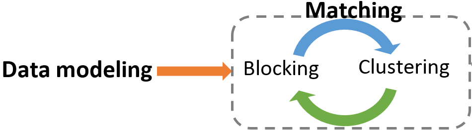

# Swash Data Modeling
**Mohsen Raeesi**

2019, June

 
 
Swash is a personal name matching framework which inspired by the human thinking. It consists of two major phases: 

1. **Data modeling**: Names are transformed into a rich HIN (Heterogeneous Information Network). This phase is implemented using R language, which is publicly available in [the current repository](https://github.com/MohsenIT/swash-data-modeling) .
2. **Matching**: This phase alternates between the blocking stage, which finds possible candidate names, and clustering stage, which clusters the candidates. This phase is implemented with Java, and it is available on [link](https://github.com/MohsenIT/swash-matching).

<p align="center">
  
</p>
<p align="center">
  <em>The general process of Swash name matching framework</em>
</p>

The rest of this markdown is dedicated to **Data Modeling** phase. This phase reads [raw dataset](https://github.com/MohsenIT/swash-data-modeling/tree/master/data). and constructs a reach HIN. For more information read [the related journal paper](https://www.sciencedirect.com/science/article/pii/S0957417419308322) .

# 1- Network schema of the Swash layered HIN

The proposed layered network consists of three main segments:

1. references
2. clusters
3. elements


The references segment (layer 0, REF vertices) contains unique name references that contain in the input data. These references should be clustered to identify their underlying entities. The clusters segment consists of the vertices of layer -1 (CLS and RID types), which points to the same entity references of layer 0. The positive layers of the proposed network (layer 1 to 3: TKN, SIM, and ABR) form elements segment, which is used to compute the similarity between references. These layers contain the tokens of references and the more abstract forms of these tokens. Applying a similarity hash-based function (like Soundex) on layer 1 forms layer 2, and abbreviating (first character) layer 2 forms layer 3. Every similarity hash-based function, which increases abstraction, can be utilized for layer 2, such as phonetic coding, nicknames prior knowledge, and token's n-grams.

## 1-1- Node Types

The following table describes the various types of nodes in Swash HIN.

| label | layer | description                                                                          | segment   | properties                        |
|-------|-------|--------------------------------------------------------------------------------------|-----------|-----------------------------------|
| CLS   | -1    | Identified clusters                                                                  | cluster   | Frequency                         |
| RID   | -1    | Resolved IDs (if gold standard exists)                                               | cluster   | Frequency                         |
| REF   | 0     | References of names                                                                  | reference | Frequency, value                  |
| TKN   | 1     | Tokens of names' references                                                          | element   | Frequency, value, no. of clusters |
| SIM   | 2     | The representative of similar tokens such as the same phonetic hash code or nickname | element   | Frequency, value, no. of clusters |
| ABR   | 3     | Abbreviated of tokens (the first character)                                          | element   | Frequency, value, no. of clusters |


## 1-2- Edge Types

The Swash graph consists of different types of edges, as follows:

| label           | out-l | in-l | description                                                                     | properties                                        | 
|-----------------|-------|------|---------------------------------------------------------------------------------|---------------------------------------------------| 
| RID_REF         | -1    | 0    | Reference names belonging to the same person                                    |                                                   | 
| CLS_REF         | -1    | 0    | Reference names in the same cluster                                             |                                                   | 
| CLS_TKN, CLS_SIM | -1    | 1, 2  | Cluster profile that presents the names' elements of the cluster representative | Token's order, PON tag (prefix, first name, etc.) | 
| REF_REF         | 0     | 0    | The similarity between reference pair according to blocking the result          | similarity                                        | 
| REF_TKN         | 0     | 1    | Tokens of the reference name                                                    | Token's order, PON tag                            | 
| TKN_TKN         | 1     | 1    | Consecutive tokens' pairs                                                       | Frequency                                         | 
| TKN_SIM         | 1     | 2    | Similarity representative of the token vertex                                   |                                                   | 
| SIM_ABR         | 2     | 3    | Abbreviated form of the SIM vertex                                              |                                                   | 


# 2- Construct the Swash HIN

In this section, we implement the Swash data modeling phase in several steps.

## 2-1- Input Arguments

In this section address of external files and some info about them is manualy defined.


```r
data_name = 'arxiv'
# data_name = 'citeseer'
# data_name = 'dblp'
# data_name = 'dblp_naumann'


input_xlsx_columns <- c("id", "name", "resolved_id")
input_xlsx_path <- sprintf("../data/%s_input.xlsx", data_name)
input_xlsx_probable_errata_path <-  sprintf("../data/%s_input_probable_errata.xlsx", data_name)
input_csv_nicknames_path <- "../data/nicknames.csv"
out_csv_edges_path <- sprintf('../out/%s_edge_list.csv', data_name)
out_csv_nodes_path <- sprintf('../out/%s_node_list.csv', data_name)
```


## 2-2- Read raw input data

Read 3 column from input excel data:

1. id: unique id of each reference as a primary key .
2. name: complete person name of the reference.
3. res_id: resolved id of the reference.

Afterward, the errata in the resolved_id are fixed.


```r
library(data.table)
library(readxl)
source("helper_functions.R")
set.seed(45L)

if(data_name != 'dblp_naumann') {
  ref_dt <- as.data.table(read_xlsx(input_xlsx_path)[, input_xlsx_columns])
} else ref_dt <- fread(gsub('.xlsx','.csv', input_xlsx_path))

ref_dt <- ref_dt[!duplicated(ref_dt), ]
names(ref_dt) <- c("id", "name", "res_id")

# fix errata of resolved_ids
errata_dt <- as.data.table(read_xlsx(input_xlsx_probable_errata_path, sheet=1))
errata_dt <- errata_dt[!is.na(errata_dt$new_res_id), c('res_id', 'new_res_id')]
errata_dt <- errata_dt[errata_dt$new_res_id != errata_dt$res_id & !duplicated(errata_dt), ]

setkey(ref_dt, res_id)
setkey(errata_dt, res_id)
ref_dt[errata_dt, res_id := i.new_res_id]
remove(errata_dt, input_xlsx_path, input_xlsx_columns, input_xlsx_probable_errata_path)
```


## 2-3- create datatable from explicit relations
Adding explicit relations of dataset, including the following vertices and edges between them:

1. resolved id of each reference, if exist.
2. name references (unique names)
3. tokens of each references


```r
node_dt <- data.table(id=integer(), val=character(), label=character(), weight=integer())
edge_dt <- data.table(from_id=integer(),to_id=integer(), from_val=character(), to_val=character(), type=character(), weight=numeric())

# add res_id nodes
if(nrow(ref_dt[!is.na(ref_dt$res_id)]) > 0)
  node_dt <- dt.append(node_dt, data.table(id=0, val=ref_dt[!is.na(ref_dt$res_id)]$res_id, label='RID', weight=1))

# add name and res_id nodes for each references
names <- gsub('[`\'\\{\\}]', '', tolower(ref_dt$name))
names <- gsub("(?<=[\\s])\\s*|^\\s+|\\s+$", "", names, perl=TRUE)

# change lname and fname order of names with comma
ind <- sapply(strsplit(names, ","), length) > 1 
names[ind] <- sapply(strsplit(names, ",")[ind], function(x) paste(trimws(x[2]), trimws(x[1])))
names <- unlist(names)

node_dt <- dt.append(node_dt, data.table(id=0, val=names, label='REF', weight=1))
node_dt <- node_dt [, .(weight=sum(weight)), by=.(id, val, label)] # dedup & aggr
node_dt[,id:=seq(nrow(node_dt))] # update id to a seq after aggr

# add 'RID_REF' edges
rr <- data.table(from_val=as.character(ref_dt$res_id), to_val=names, type='RID_REF', weight=1)
rr <- rr[, .(weight=sum(weight)), by=.(from_val, to_val, type)] # dedup & aggr
edge_dt <- dt.append(edge_dt, add.id.columns(rr, node_dt[label=='RID'], node_dt[label=='REF']))
remove(rr)

# add token nodes for each unique name
name_tokens <- strsplit(trimws(gsub("[^[:alpha:]]", " ", names)), " +")
tokens <- unlist(name_tokens)
t <- data.table(id=0, val=tokens, label=ifelse(nchar(tokens) == 1, 'ABR','TKN'), weight=1)
rt_types <- paste('REF_', t$label, sep = '')
t <- t[, .(weight=sum(weight)), by=.(id, val, label)] # dedup & aggr
t[,id:=seq.int(from = max(node_dt[, id])+1, length.out = nrow(t))] # update id to a seq
node_dt <- dt.append(node_dt, t)

rt <- data.table(from_val=rep(names, sapply(name_tokens, FUN=length)), to_val=tokens, type=rt_types, weight=unlist(sapply(sapply(name_tokens, FUN=length), FUN = seq)))
edge_dt <- dt.append(edge_dt, add.id.columns(unique(rt), node_dt[label=='REF'], node_dt[label %in% c('TKN', 'ABR')]))
remove(names, name_tokens, t, rt, tokens, rt_types)
```

## 2-4- Adding token sequence edges
each consecutive tokens represents as an edge in this phase.

CAUTION: CURRENTLY, IT IS NOT RUNNED BY DEFAULT DUE TO `eval=FALSE`


```r
# add reference freq to the REF_TKN edges
tmp_tokens <- merge(edge_dt[type=='REF_TKN'], node_dt[label=='REF'], by.x='from_id', by.y='id') [, .(from_val, to_val, to_id, weight.x, weight.y)][order(from_val, weight.x)]
tmp_head <- c('ref', 'token', 'from_id', 'seq', 'freq')
names(tmp_tokens) <- tmp_head

# add lead to_val column to the edges for edge generation
tmp_head_lead <- paste("to", tmp_head, sep="_")
tmp_tokens[, (tmp_head_lead) := shift(.SD, 1, 0, "lead"), .SDcols=tmp_head]

ts <- tmp_tokens[ref == to_ref & seq + 1 == to_seq, .(token, to_token, freq)]
ts <- ts[, .(weight=sum(freq)), by=.(token, to_token)] [order(to_token, token)]

# add final seq edges to edge_dt
ts <- data.table(from_val=ts$token, to_val=ts$to_token, type='TKN_TKN', weight=ts$weight)
edge_dt <- dt.append(edge_dt, add.id.columns(ts, node_dt[label=='TKN'], node_dt[label=='TKN']))

remove(tmp_head, tmp_head_lead, ts, tmp_tokens)
```

## 2-5- Adding 2nd level: similarity level
The phonic hash of 1st level tokens make 2nd level nodes. Edges between 1st and 2nd level can be generated by two citeria:

1. **Exact match**: each 1st level token nodes only connect to each hash in 2nd level
2. **Similarity match**: in addition to exact match, also similar hashes have connection to a token node

First we start with the first criterion, but we plan to extend it to the second one.


```r
library(phonics)
s <- node_dt[label=='TKN']
s[, `:=`(id=0, val=tolower(soundex(val)), label='SIM')]
s <- s[, .(weight=sum(weight)), by=.(id, val, label)] # dedup & aggr
s[,id:=seq(from=max(node_dt[['id']])+1, length.out = nrow(s))] # update id to a valid sequence
node_dt <- dt.append(node_dt, s)

# add 'TKN_SIM' edges
tkn <- node_dt[label=='TKN'][['val']]
tkn_weight <- node_dt[label=='TKN'][['weight']]
ts <- data.table(from_val=tkn, to_val=tolower(soundex(tkn)), type='TKN_SIM', weight=tkn_weight)
ts <- ts[, .(weight=sum(weight)), by=.(from_val, to_val, type)] # dedup & aggr
edge_dt <- dt.append(edge_dt, add.id.columns(ts, node_dt[label=='TKN'], node_dt[label=='SIM']))

remove(s, ts, tkn, tkn_weight)
```

Add similarity token to nicknames node:

```r
nck <- fread(input_csv_nicknames_path, col.names = c('to_val', 'val'))
nck <- merge(node_dt[label=='TKN'], nck, by="val") # filter nicknames available in tokens

# add NCK nodes in level 2
nck.nodes <- nck[, .(cnt=.N, weight=sum(weight)), by=.(to_val)][cnt>1]
ids <- seq(from=max(node_dt[['id']])+1, length.out =nrow(nck.nodes))
nck.nodes <- data.table(id=ids, val=nck.nodes[['to_val']], label='NCK', weight=nck.nodes[['weight']])
node_dt <- dt.append(node_dt, nck.nodes)

# add 'TKN_NCK' edges
col.order <- c('id.x', 'id.y', 'val', 'to_val', 'label.y', 'weight.x')
nck.edges <- merge(nck, nck.nodes, by.x ="to_val", by.y = "val")[, ..col.order]
nck.edges[, label.y := 'TKN_NCK']
edge_dt <- dt.append(edge_dt, nck.edges)

remove(nck, nck.nodes, nck.edges, ids, col.order)
```


## 2-6- Adding 3rd level: abbreviated level
The abbreviated form of 2nd level tokens make 3rd level nodes.


```r
# add 'ABR' nodes
a <- node_dt[label=='SIM']
a[, `:=`(id=0, val=tolower(substr(val, 1, 1)), label='ABR')]
a <- a[, .(weight=sum(weight)), by=.(id, val, label)] # dedup & aggr
a <- a[a$val %!in% node_dt[label=='ABR']$val] # filter only ABR which is not node_dt
a[,id:=seq(from=max(node_dt[['id']])+1, length.out = nrow(a))] # update id to a valid sequence
node_dt <- dt.append(node_dt, a)

# add 'SIM_ABR' edges
sim <- node_dt[label=='SIM'][['val']]
sim_weight <- node_dt[label=='SIM'][['weight']]
sa <- data.table(from_val=sim, to_val=substr(sim, 1, 1), type='SIM_ABR', weight=sim_weight)
sa <- sa[, .(weight=sum(weight)), by=.(from_val, to_val, type)] # dedup & aggr
edge_dt <- dt.append(edge_dt, add.id.columns(sa, node_dt[label=='SIM'], node_dt[label=='ABR']))

remove(a, sa, sim, sim_weight)
```


## 2-7- Write the result to a file

Modifying columns name according to standard of Neo4j import tool and write node and edge datatables to CSV files.


```r
names(node_dt) <- c('id:ID', 'val:string','label:LABEL', 'weight:int')
names(edge_dt) <- c('fr_id:START_ID', 'to_id:END_ID', 'fr_val:string', 'to_val:string', 'type:TYPE', 'val:int')
fwrite(node_dt, file = out_csv_nodes_path, sep = "\t")
fwrite(edge_dt, file = out_csv_edges_path, sep = "\t")
```

