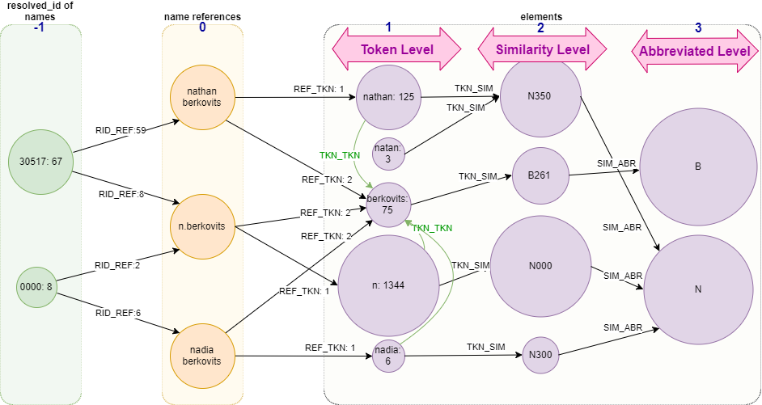

<style>

h1, h2, h3, h4, h5, h6 {
  direction: rtl;
  font-family: IRANSans, "Iranian Sans", IRTitr, tahoma;
}
p, ol, li, ul, table {
  direction: rtl;
  font-family: IRANSans, "Iranian Sans", IRNazanin, tahoma;
  text-align: justify;
  text-justify: kashida;
}
td, th, header {
  text-align: center !important;
  vertical-align: middle;
}

div.ltr p, div.ltr ol, div.ltr li, div.ltr ul, div.ltr table, div.ltr h1, div.ltr h2, div.ltr h3{ 
  direction: ltr; 
}

tr:nth-child(odd) {
   background-color: #f2f2f2
}

</style>
 
 
در این بخش ما بنا داریم تا مجموعه داده اسامی را بخوانیم و آن را به گرافی ناهمگون تبدیل کنیم که در آن تمامی اطلاعات توزیع اسامی و همچنین توالی هر یک از بخش های نام کد شده است. در ادامه باید الگوریتمی ارائه دهیم که بتواند از این گراف به گونه ای بهره برداری نماید که 

* در گام اول، روی اسامی خوشه بندی انجام دهد.
* در گام دوم بتواند ساختار سلسله مراتبی اسامی (چه نامی می تواند با دیگری یکی باشد؟) را استخراج کند.

# 1- ساختار گراف تطبیق اسامی
گراف تطبیق اسامی یک گراف ناهمگون اطلاعات است و دارای انواع مختلفی از گره و یال می باشد. لازم به ذکر است که این گراف یک MultiGraph نبوده و بین هر دو گره تنها یک یال وجود دارد.

## 1-1- گره های گراف
گراف مد نظر شامل انواع گره زیر است:

1. نام کامل
2. توکن های نام
3. شناسه های ریزالو شده

هر کدام از این گره ها شامل وزنی هستند که نشان دهنده تعداد رخداد آن است.

## 2-1- یال های گراف
یال های گراف می تواند انواع متفاوتی داشته باشد. در حال حاضر انواع متصور برای گراف شامل موارد زیر است.

| سطح     | نوع                 | گره مبداء        | گره مقصد               | برچسب    | وزن             |
| ------- | ------------------- | ---------------- | ---------------------- | -------- | --------------- |
| R-->0 | شناسه ریزالو هر نام | شناسه ریزالو شده | نام                    | RID_REF  | تعداد تکرار نام |
| 0-->1 | رتبه هر توکن در نام | نام              | قطعه نام               | REF_TKN  | رتبه در نام     |
| 1-->1 | توالی توکن ها       | قطعه نام         | قطعه بعدی در توالی نام | TKN_TKN  | تعداد تکرار     |
| 1-->2 | شباهت توکن ها       | قطعه نام         | هش های شبیه            | TKN_SIM  | تعداد تکرار     |
| 2-->3 | شباهت توکن ها       | هش               | مخفف یا همان حرف اول   | SIM_ABR  | تعداد تکرار     |
|         |                     |                  |                        |          |                 |


###1- ورود داده به برنامه
ابتدا نام ها به همراه شناسه رفرنس و شناسه ریزالو شده آن ها خوانده می شود.
سپس اشکالات برچسب شناسه واقعی آن تصحیح می شود.

```{r message=FALSE, warning=FALSE}
library(data.table)
library(readxl)
source("helper_functions.R")
set.seed(45L)

# ref_dt <- fread("../data/arxiv/authors.csv")[, c("id", "name", "author_cluster_id")]
ref_dt <- as.data.table(read_xlsx("../data/arxiv/authors.xlsx")[, c("id", "name", "author_cluster_id")])
ref_dt <- ref_dt[!duplicated(ref_dt), ]
names(ref_dt) <- c("id", "name", "res_id")

errata_dt <- as.data.table(read_xlsx("../data/arxiv/nodes_component_mashkook.xlsx", sheet=1))
errata_dt <- errata_dt[!is.na(errata_dt$new_res_id), c('res_id', 'new_res_id')]
errata_dt <- errata_dt[errata_dt$new_res_id != errata_dt$res_id & !duplicated(errata_dt), ]

setkey(ref_dt, res_id)
setkey(errata_dt, res_id)
ref_dt[errata_dt, res_id := i.new_res_id]
remove(errata_dt)
```


###2- ایجاد دیتا تیبل از بخش های صریح گراف تطبیق نام
گراف تطبیق نام از سه بخش اصلی تشکیل شده است:

1. شناسه ریزالوشده
2. نام های کامل
3. توکن های موجود در هر نام و ارتباط بین آن ها

در مرحله اول اطلاعات صریح (همه موارد به غیر از ارتباطات بین توکن ها) به صورت یک گراف کد می شود.
بخش های کد شده در این مرحله در شکل زیر نمایش داده می شود.




```{r}
node_dt <- data.table(id=integer(), val=character(), label=character(), weight=integer())
edge_dt <- data.table(from_id=integer(),to_id=integer(), from_val=character(), to_val=character(), type=character(), weight=numeric())

# add res_id nodes
node_dt <- dt.append(node_dt, data.table(id=0, val=ref_dt$res_id, label='RID', weight=1))

# add name and res_id nodes for each references
names <- gsub('[`\'\\{\\}]', '', tolower(ref_dt$name))
node_dt <- dt.append(node_dt, data.table(id=0, val=names, label='REF', weight=1))
node_dt <- node_dt [, .(weight=sum(weight)), by=.(id, val, label)] # dedup & aggr
node_dt[,id:=seq(nrow(node_dt))] # update id to a seq

# add 'RID_REF' edges
rr <- data.table(from_val=as.character(ref_dt$res_id), to_val=names, type='RID_REF', weight=1)
rr <- rr[, .(weight=sum(weight)), by=.(from_val, to_val, type)] # dedup & aggr
edge_dt <- dt.append(edge_dt, add.id.columns(rr, node_dt[label=='RID'], node_dt[label=='REF']))
remove(rr)

# add token nodes for each unique name
name_tokens <- strsplit(gsub("[^[:alnum:]]", " ", names), " +")
t <- data.table(id=0, val=unlist(name_tokens), label='TKN', weight=1)
t <- t[, .(weight=sum(weight)), by=.(id, val, label)] # dedup & aggr
t[,id:=seq.int(from = max(node_dt[, id])+1, length.out = nrow(t))] # update id to a seq
node_dt <- dt.append(node_dt, t)

rt <- data.table(from_val=rep(names, sapply(name_tokens, FUN=length)), to_val=unlist(name_tokens)
                 , type='REF_TKN', weight=unlist(sapply(sapply(name_tokens, FUN=length), FUN = seq)))
edge_dt <- dt.append(edge_dt, add.id.columns(unique(rt), node_dt[label=='REF'], node_dt[label=='TKN']))
remove(names, name_tokens, t, rt)
```

###3- افزودن یال های توالی بین توکن ها
این که هر یک از توکن ها چند بار بعد از چه توکنی آمده است، اطلاعات ارزشمندی از توالی ها ارائه می نماید. در این مرحله یال های نشانگر این اطلاعات نیز به گراف اضافه می شود.

```{r, eval=FALSE}
# add reference freq to the REF_TKN edges
tmp_tokens <- merge(edge_dt[type=='REF_TKN'], node_dt[label=='REF'], by.x='from_id', by.y='id') [, .(from_val, to_val, to_id, weight.x, weight.y)][order(from_val, weight.x)]
tmp_head <- c('ref', 'token', 'from_id', 'seq', 'freq')
names(tmp_tokens) <- tmp_head

# add lead to_val column to the edges for edge generation
tmp_head_lead <- paste("to", tmp_head, sep="_")
tmp_tokens[, (tmp_head_lead) := shift(.SD, 1, 0, "lead"), .SDcols=tmp_head]

ts <- tmp_tokens[ref == to_ref & seq + 1 == to_seq, .(token, to_token, freq)]
ts <- ts[, .(weight=sum(freq)), by=.(token, to_token)] [order(to_token, token)]

# add final seq edges to edge_dt
ts <- data.table(from_val=ts$token, to_val=ts$to_token, type='TKN_TKN', weight=ts$weight)
edge_dt <- dt.append(edge_dt, add.id.columns(ts, node_dt[label=='TKN'], node_dt[label=='TKN']))

remove(tmp_head, tmp_head_lead, ts, tmp_tokens)
```

<div class = "ltr">
###4- Adding 2nd level: similarity level
The phonic hash of 1st level tokens make 2nd level nodes. Edges between 1st and 2nd level can be generated by two citeria:

1. **Exact match**: each 1st level token nodes only connect to each hash in 2nd level
2. **Similarity match**: in addition to exact match, also similar hashes have connection to a token node

First we start with the first criterion, but we plan to extend it to the second one.


```{r message=FALSE, warning=FALSE}
library(phonics)
s <- node_dt[label=='TKN']
s[, `:=`(id=0, val=soundex(val), label='SIM')]
s <- s[, .(weight=sum(weight)), by=.(id, val, label)] # dedup & aggr
s[,id:=seq(from=max(node_dt[['id']])+1, length.out = nrow(s))] # update id to a valid sequence
node_dt <- dt.append(node_dt, s)

# add 'TKN_SIM' edges
tkn <- node_dt[label=='TKN'][['val']]
tkn_weight <- node_dt[label=='TKN'][['weight']]
ts <- data.table(from_val=tkn, to_val=soundex(tkn), type='TKN_SIM', weight=tkn_weight)
ts <- ts[, .(weight=sum(weight)), by=.(from_val, to_val, type)] # dedup & aggr
edge_dt <- dt.append(edge_dt, add.id.columns(ts, node_dt[label=='TKN'], node_dt[label=='SIM']))

remove(s, ts, tkn, tkn_weight)
```

###5- Adding 3rd level: abbreviated level
The abbreviated form of 2nd level tokens make 3rd level nodes.

```{r message=FALSE, warning=FALSE}
# add 'ABR' nodes
a <- node_dt[label=='SIM']
a[, `:=`(id=0, val=substr(val, 1, 1), label='ABR')]
a <- a[, .(weight=sum(weight)), by=.(id, val, label)] # dedup & aggr
a[,id:=seq(from=max(node_dt[['id']])+1, length.out = nrow(a))] # update id to a valid sequence
node_dt <- dt.append(node_dt, a)

# add 'SIM_ABR' edges
sim <- node_dt[label=='SIM'][['val']]
sim_weight <- node_dt[label=='SIM'][['weight']]
sa <- data.table(from_val=sim, to_val=substr(sim, 1, 1), type='SIM_ABR', weight=sim_weight)
sa <- sa[, .(weight=sum(weight)), by=.(from_val, to_val, type)] # dedup & aggr
edge_dt <- dt.append(edge_dt, add.id.columns(sa, node_dt[label=='SIM'], node_dt[label=='ABR']))

remove(a, sa, sim, sim_weight)
```


###5- Output result on file

Modifying columns name according to standard of Neo4j import tool and write node and edge datatables to CSV files.

```{r message=FALSE, warning=FALSE}
names(node_dt) <- c('id:ID', 'val:string','label:LABEL', 'weight:int')
names(edge_dt) <- c('fr_id:START_ID', 'to_id:END_ID', 'fr_val:string', 'to_val:string', 'type:TYPE', 'val:int')
fwrite(node_dt, file = '../out/node_list.csv')
fwrite(edge_dt, file = '../out/edge_list.csv')
```
</div>


والسلام

